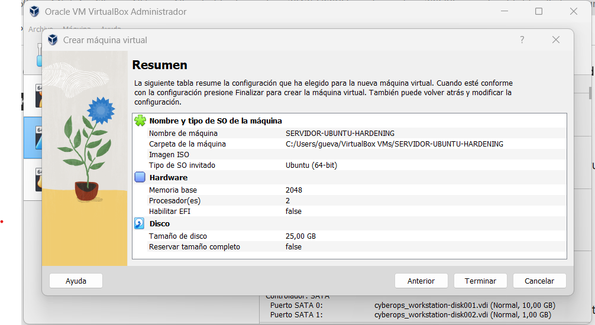
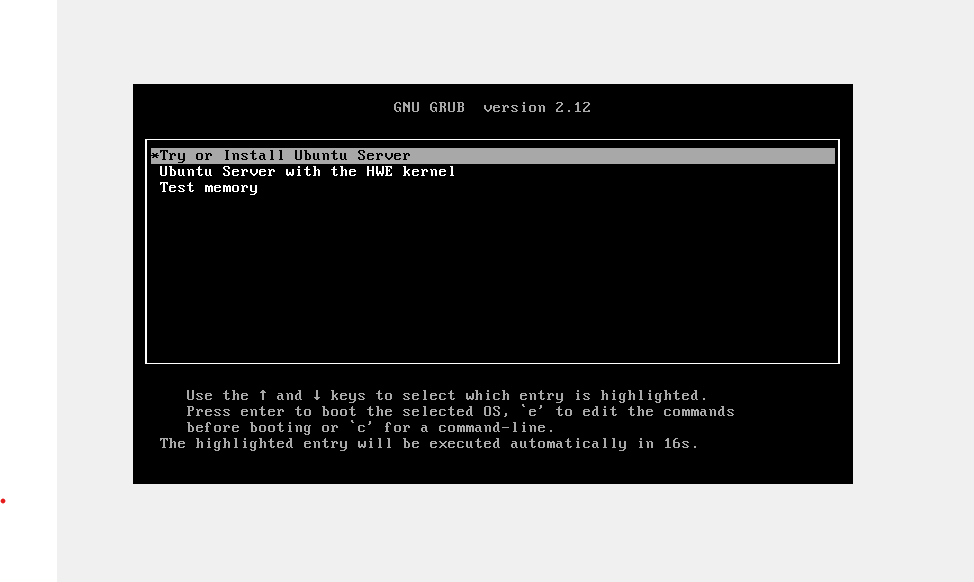
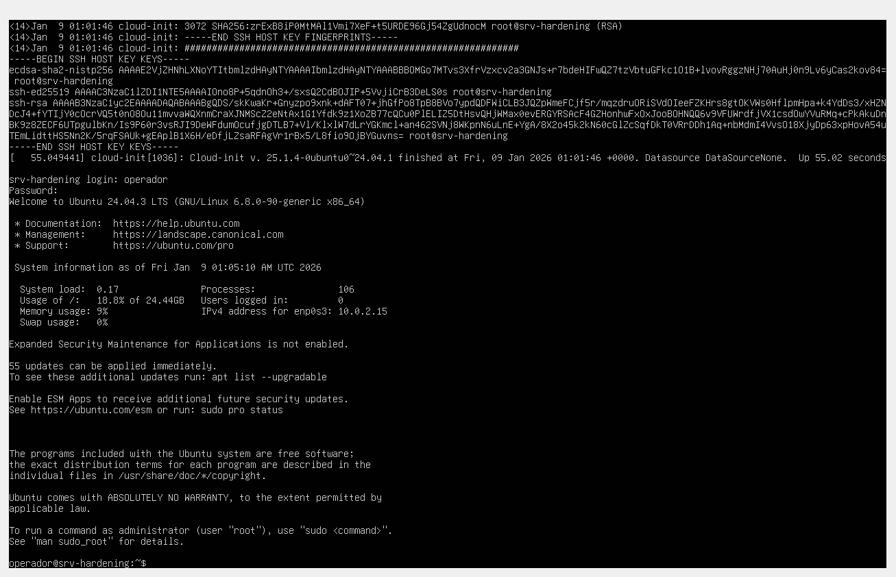
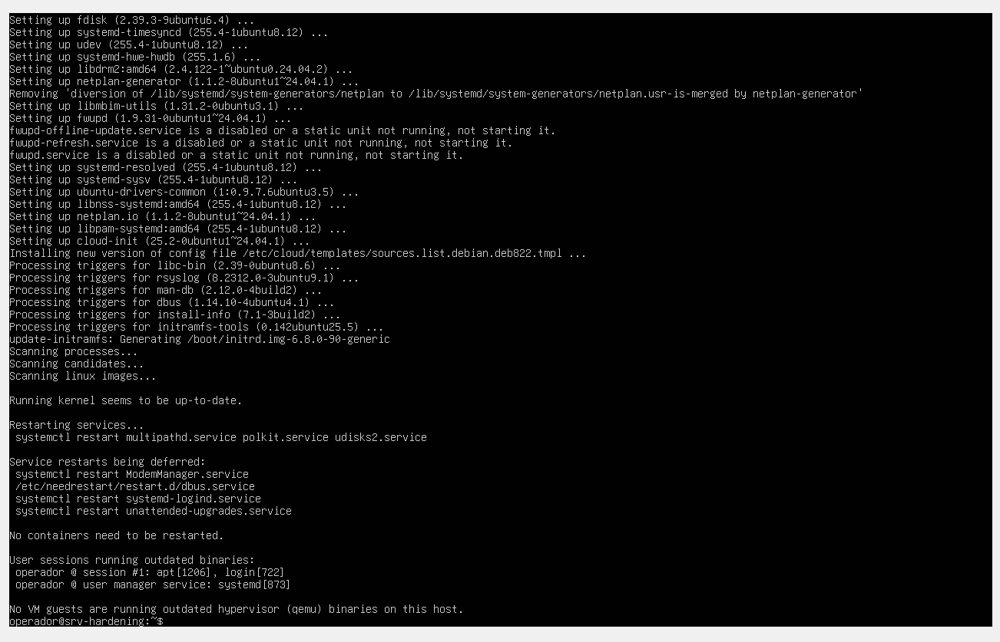
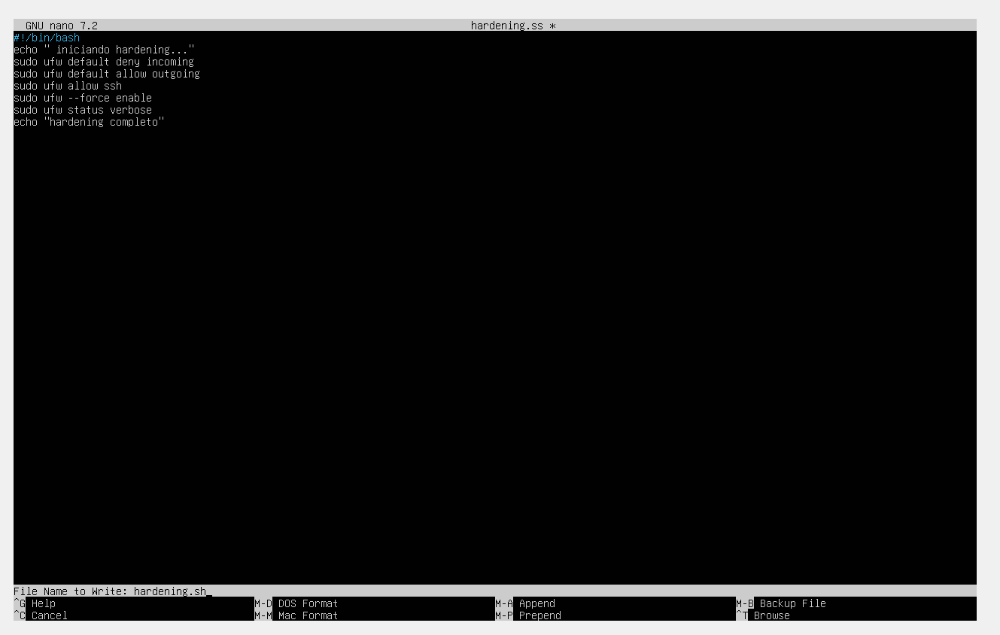
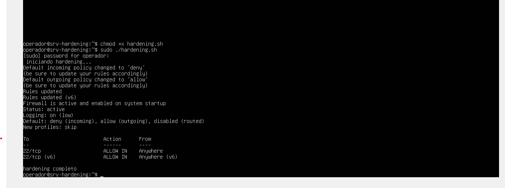

## Auditoría y Hardening Automatizado de Servidor Linux

## 🛡️ Descripción del Proyecto

Este proyecto consiste en el despliegue de un servidor **Ubuntu Server 24.04 LTS** en un entorno virtualizado y la aplicación de un script de **Hardening** para reducir la superficie de ataque inicial.

## 🛠️ Herramientas Utilizadas

**Virtualización:** Oracle VM VirtualBox.

**Sistema Operativo:** Ubuntu Server 24.04.3 LTS.

**Lenguaje:** Bash Scripting.

**Seguridad:** UFW (Uncomplicated Firewall) y parches de seguridad críticos.

## Fases del Proyecto

1. **Aprovisionamiento:** Configuración de VM con 2GB RAM, 2 CPUs y 25GB de almacenamiento.

2. **Instalación:** Despliegue de SO base (en proceso).

3. **Ejecución de Hardening:**

Actualización de paquetes:
**comando utilizados:** sudo apt update && sudo apt upgrade -y

**Automatización de reglas de firewall**
creación de archivo:

nano hardening.sh y pegamos el siguiente bash

#!/bin/bash
echo "Iniciando Hardening..."

# 1. Actualizar sistema
sudo apt update && sudo apt upgrade -y

# 2. Configurar Firewall (UFW)
sudo ufw default deny incoming
sudo ufw default allow outgoing
sudo ufw allow ssh
sudo ufw --force enable

# 3. Limpieza de servicios innecesarios
sudo apt autoremove -y

echo "Hardening completado"

4. **Validación:** 
Auditoría de puertos y servicios activos.

5. **Conclusión:**

La ejecución de este proyecto demuestra la importancia de establecer una base de seguridad sólida desde el despliegue inicial del servidor. A través de la automatización, se han logrado los siguientes objetivos:
**Minimización de riesgos:** Se redujo la superficie de ataque al cerrar todos los puertos innecesarios mediante UFW.
**Gestión de parches:** Se garantizó la integridad del sistema operativo mediante la actualización automatizada de paquetes críticos.
**Eficiencia operativa:** El uso de Bash Scripting permite aplicar estas mismas reglas de hardening en cualquier servidor Ubuntu de forma rápida y sin errores manuales.
Este servidor ahora cuenta con una configuración robusta, listo para recibir capas de seguridad adicionales en futuras auditorías.

